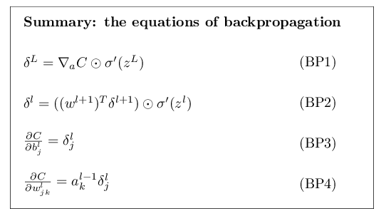

# backpropagation算法原理
  
-------------------------
  
> Backpropagation核心解决的问题: ∂C/∂w 和 ∂C/∂b 的计算, 针对cost函数C
  

> 表示第从第(3-1)层的的第4个神经元到第3层的第2个神经元的权重weight 
  

> 表示第2层的第3个神经元的偏向bais
-----
## 正向传播
  
  
###### 公式:

  
  
  
  
>分为两步：
>1.  加权求和
>2. 对加权求和整体使用sigmoid函数求出下层的输出值 
##### 数据结构
  
> 对于每一层(l),定义一个权重矩阵     (weight matrix):，这个权重矩阵包含当前层的所有神经元到前一层的所有神经元的权重
>> 表示第从第l层的的第j个神经元到第l-1层的第k个神经元的权重weight 
  
>对于每一层(l),定义一个偏向向量(bais vector):
>> 则表示l层的第k个神经元的bais
  
>同理，对于：l层的神经元向量,每个神经元的值
  
  
> Vector a function: 
> 例如：
> 
>则,可以由l层的每一个元素的计算公式可以退出该层矩阵运算的公式:

  
  
>其中可以用表示,即第l层权重矩阵的第j个行向量与前一层神经元的列向量进行内积的结果,令，则。
>简单点理解：对于每层正向传播,每层的值(向量形式)就是当前层的权重矩阵与上一层的值(向量)相乘再加上当前层的偏向(向量),然后统一使用sigmoid函数转化
--------------
  
## 关于Cost函数的两个假设:
  
> 二次Cost函数
>

  
  
>其中表示输出层的真实值所组成的向量,表示训练实例，n表示输入实例的个数。
  
> 1. 第一个假设是成本函数可以写成单个训练样例的成本函数的平均值。二次成本函数就是这种情况，单个训练样例的Cost函数为
>2. 第二个假设是它可以写​​成神经网络输出的函数：
>
二次Cost函数满足这个要求，因为单个训练样例x的二次Cost可写为

  
  
>###### 介绍一个后面需要用到的公式
>The Hadamard product, s⊙t,向量对应元素相乘:
>
--------------
  
## backpropagation4个重要公式
  

> 反向传播是关于如何改变网络中的权重和偏差来改变成本函数，这意味着需要计算偏导数 和 。但为了计算这些，我们首先引入一个中间量，，我们称之为在l层的第j个神经元的error。反向传播计算每一层的，然后将与 和 关联起来。
>
>为了理解错误是如何定义的，想象我们的神经网络中存在一个恶魔：
  

>恶魔对第l层的第j个神经元添加一个变化量,该神经元输出就变成。这种变化通过网络中的后续层传播，最终导致整体Cost的变化（简单的高数知识）。
> 如果这个恶魔是一个好人，它想要帮我们优化Cost，他会尝试一个更小的使得损失函数更小。假设是一个很大的值(不管正负)。然后恶魔通过选择与有相反的符号的 来降低Cost。相反，如果  接近于零，那么恶魔通过干扰加权输入就几乎不能改变Cost,此时，这个神经元已经非常接近最优(再如何优化也不能改变Cost)。所以这里把 定义为神经元error的度量。
>于是定义在l层的第j个神经元的error
  
BP1
> 我们定义在输出层(L)的第j个神经元的error的方程为:

  
  
> ###### 解释:其中这部分衡量Cost相对于第j个神经元activation的输出的变化率,这部分衡量activation方程相对于中间变量的变化率
> 转化为矩阵的表达形式

  
  
可以认为 表示C相对于输出activation的变化率，根据上面定义的2次Cost方程，输出层的error可以写成:

  
  
  
BP2
> 因为下一层的error的变化会引起当前层error的变化,当前层(l层)的error变化方程为(error传递公式):

  
  
其中是第层的权重矩阵的转置。第层处的error 乘以权重矩阵的转置时，我们可以直观地认为网络向前传递error。然后,可以算出前一层的error。
交替使用可以算出神经网络的所有层的error
  
BP3
> Cost对偏向求偏导：
> 

  
  
> 写成向量形式:
> 

  
  
  
BP4
>Cost对权重求偏导:

  
  
写成矩阵形式:

  
  
  
  
  
[公式证明参考](http://neuralnetworksanddeeplearning.com/chap2.html#proof_of_the_four_fundamental_equations_(optional ))
  