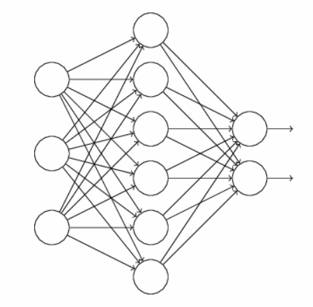
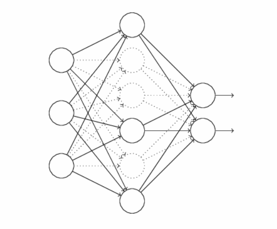

[TOC]

# dropout

## 介绍
> 减少过拟合的方法除了正则化，扩大训练集规模外，还有dropout，下面将详细介绍dropout

和正则化不同，dropout不是改变Cost函数，而是直接改变神经网络的结构。  
举个列子，假如我们神经网络的结构如下:  

dropout方法，在原来的神经网络基础上，随机删除神经网络隐藏层一半的神经元，保持输入层和输出层不变，然后在这个改变后的神经网络上进行正向和反向传播。  
  
重复此过程
最后,学习出来的神经网络中的每个神经元都是在只有一半神经元的基础上学习的, 当所有神经元被恢复后, 为了补偿, 我们把隐藏层的所有权重减半。

## 为什么dropout能减少overfitting
假设我们对于同一组训练数据, 利用不同的神经网络来训练, 训练完成之后, 求输出的平均值, 这样可以减少overfitting  

Dropout和这个是同样的道理, 每次扔到一半隐藏层的神经元, 相当于我们在不同的神经网络上训练了

减少了神经元的依赖性, 也就是每个神经元不能依赖于某个或者某几个其他神经元, 迫使神经网聚学习更加和其他神经元联合起来的更加健硕的特征
