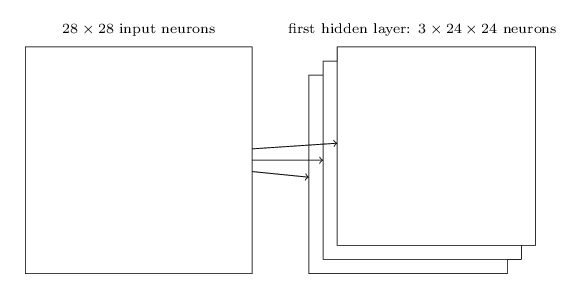
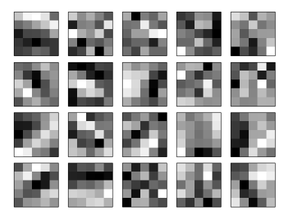

[TOC]
# 卷积神经网络
------

##  卷积神经网络介绍CNN

我们传统的神经网络相邻层使用完全连接的方式，也就是说神经网络中每个神经元都与相邻层的所有神经元进行连接。
  

传统的深度神经网络的输入和输出都是一维的神经元组成的向量,还是用之前的手写数字识别的例子，其中输入由28*28的784个神经元组成，输出由10个神经元组成

> 而CNN的结构改变了，CNN的输入层是一个二维的神经元:

### 一个概念local receptive field:

第一个隐藏层中的每个神经元将连接到输入神经元的一个小区域(local receptive fields),这个区域可以人为设定5\*5,3\*3...对于这个区域内的神经元，与隐藏层的神经元进行连接

我们扫描输入神经元的所有局部特征区域(local receptive fields)，向右扫描，下移继续向右扫描，下面图展示了扫描的过程，这里每次移动一步，每次移动多少距离，可以根据自己的需要来调整：  

> 向右扫描，将选取的局部特征区域向右移动一个像素，相应的连接隐藏层的第二个神经元  

  

像这样，我们不断的向右扫描，扫描完一行就下移一行继续扫描，知道扫描完所有的输入神经元，这样第一个第一个隐藏层的值就都求出来了。

> CNN的特点，每个神经元学习原始输入的一部分特征,这样可以保持原始图片空间二维的特征 

### 共享权重和偏向：

局部特征区域与一个神经元进行连接，区域内的所有神经元与隐藏层神经元相连接。

每条连线有对应的权重，如上图的例子，权重矩阵是一个5*5的矩阵，这个权重矩阵也叫做“卷积核”，每次向右移动局部感知区域，这个权重矩阵都不改变，这就是所谓的共享权重。

共享偏向就比较简单了，就是局部特征区域的所有神经元与第一个隐藏层的神经元进行连接，第一个隐藏层的神经元的偏向当然只有一个（其实感觉也不能叫做共享偏向），具体看看下面图和公式就理解了。

> 图片来源于deep learning这本书

> 因为CNN学习的不同位置的特征,共享权重和偏向使得即使图像像素发生平移，CNN仍然能够学习出相同的特征,比如说一只猫的图片，如果移动了一下，他仍然是一只猫  

> 用之前的神经元的输出公式，改变一下就可以得到相应的输出公式:

$$\begin{eqnarray} 
  \sigma\left(b + \sum_{l=0}^4 \sum_{m=0}^4  w_{l,m} a_{j+l, k+m} \right)
\end{eqnarray}$$

### feature map（特征映射）的概念
为了更好的学习一个输入的所有特征，引入feature map（特征映射），feature map 是一个从输入层到隐藏层转化的过程，我们使用不同共享权重矩阵（下面都叫做卷积核）可以得到第一个隐藏层的对应的多个feature map  
对于一个28*28的输入层,假设我们用3个不同的卷积核，这样我们可以产生3个同样大小、不同特征映射的隐藏层：  

在实验中，我们一般会使用非常多的特征映射以学习到更多的特征，展示一个20个feature map的效果:  

上面每个图片对应一个特征映射,可以看出不同的特征映射让CNN学习到来了同一个图片的不同的特征，颜色比较深表示权重比较大，比较浅表示权重比较小。

> CNN使用共享权重和偏向使得神经网络参数的规模大大减小

对于每一个feature map, 需要 5x5=25个权重参数, 加上1个偏向b, 26个如果有20个feature maps, 总共26x20=520个参数就可以定义CNN。而之前原始的神经网络采用了全连接的方法连接神经网络的相邻层,两两相连，输入层28*28=784个神经元,假设隐藏层只有30个神经元，那么就有784 * 30个权重，加上30个偏向，工23550个参数，比CNN多了40倍。