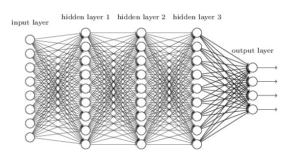
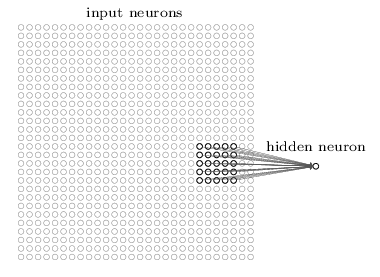
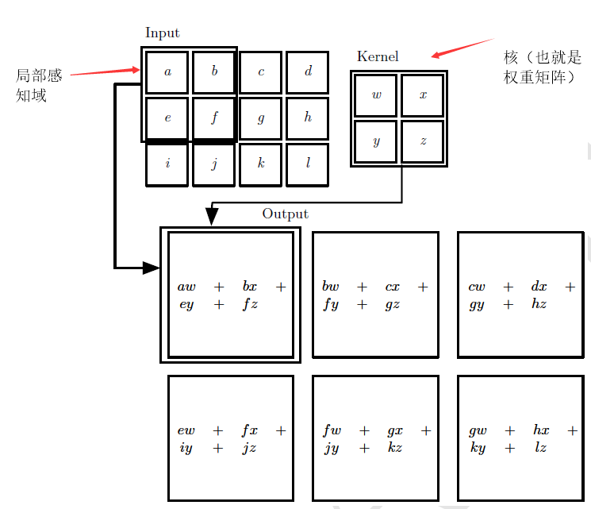

[TOC]
# 卷积神经网络
------

##  卷积神经网络介绍CNN

我们传统的神经网络相邻层使用完全连接的方式，也就是说神经网络中每个神经元都与相邻层的所有神经元进行连接。
  

传统的深度神经网络的输入和输出都是一维的神经元组成的向量,还是用之前的手写数字识别的例子，其中输入由28*28的784个神经元组成，输出由10个神经元组成

> 而CNN的结构改变了，CNN的输入层是一个二维的神经元:

### 一个概念local receptive field:

第一个隐藏层中的每个神经元将连接到输入神经元的一个小区域(local receptive fields),这个区域可以人为设定5\*5,3\*3...对于这个区域内的神经元，与隐藏层的神经元进行连接

我们扫描输入神经元的所有局部特征区域(local receptive fields)，向右扫描，下移继续向右扫描，下面图展示了扫描的过程，这里每次移动一步，每次移动多少距离，可以根据自己的需要来调整：  

> 向右扫描，将选取的局部特征区域向右移动一个像素，相应的连接隐藏层的第二个神经元  

  

像这样，我们不断的向右扫描，扫描完一行就下移一行继续扫描，知道扫描完所有的输入神经元，这样第一个第一个隐藏层的值就都求出来了。

### 共享权重和偏向：

局部特征区域与一个神经元进行连接，区域内的所有神经元与隐藏层神经元相连接。

每条连线有对应的权重，如上图的例子，权重矩阵是一个5*5的矩阵，这个权重矩阵也叫做“核”，每次向右移动局部感知区域，这个权重矩阵都不改变，这就是所谓的共享权重。

共享偏向就比较简单了，就是局部特征区域的所有神经元与第一个隐藏层的神经元进行连接，第一个隐藏层的神经元的偏向当然只有一个（其实感觉也不能叫做共享偏向），具体看看下面图和公式就理解了。

> 图片来源于deep learning这本书

> 用之前的神经元的输出公式，改变一下就可以得到相应的输出公式:

$$\begin{eqnarray} 
  \sigma\left(b + \sum_{l=0}^4 \sum_{m=0}^4  w_{l,m} a_{j+l, k+m} \right)
\end{eqnarray}$$