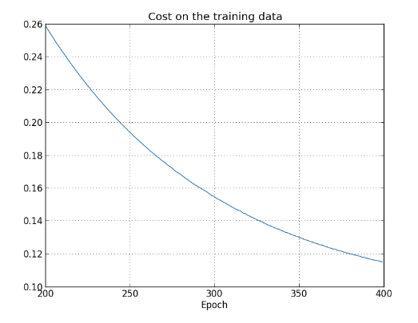
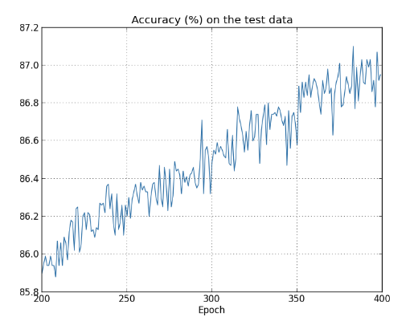

[TOC]

# 正则化

在上次笔记中，提到了过拟合，如何解决过拟合呢，其中正则化就是常见的减少过拟合的方法。其中常见的两种正则化方法分别是L2和L1正则化。

## L2正则化

### 定义及公式介绍
L2正则化又叫做weight decay（权重下降），顾名思义，让神经网络尽可能学习比较小的权重。

拿之前的损失函数:交叉熵(cross-entropy)来举例子，原始的交叉熵损失函数公式和经过L2正则化后的cross-entropy公式如下(1)(2)：  

$$
\begin{eqnarray} 
C & = & -\frac{1}{n} \sum_{xj} [ y_j \ln a^L_j+(1-y_j) \ln(1-a^L_j)].\tag{1} \\
C & = & -\frac{1}{n} \sum_{xj} [ y_j \ln a^L_j+(1-y_j) \ln
(1-a^L_j)] + \frac{\lambda}{2n} \sum_w w^2.
\tag{2}
\end{eqnarray}
$$
  

> 可以发现，我们在原来的损失函数添加了一项$\frac{\lambda}{2n}\sum_w w^2$ ,也就是加上了神经网络所有权重的平方和乘上$\frac{\lambda}{2n}$。  
其中λ是一个大于0的数，n表示训练集包含实例个数


对于二次损失函数,我们也可以使用类似的方法进行L2正则化，原始函数和正则化后的函数分别如公式(3)(4):  
$$\begin{eqnarray} 
C & = &  \frac{1}{2n} \sum_x \|y-a^L\|^2 \tag{3} \\
C & = &  \frac{1}{2n} \sum_x \|y-a^L\|^2 +
  \frac{\lambda}{2n} \sum_w w^2.
\tag{4}\end{eqnarray}$$

所以L2正则化就是对损失函数添加一项：  
$$
\begin{eqnarray} 
 C = C_0 + \frac{\lambda}{2n}\sum_w w^2 \tag{5}
\end{eqnarray}
$$  
其中$C_0$为原始的损失函数，$\frac{\lambda}{2n}\sum_w w^2$为L2正则化项。  

> 因为我们神经网络的学习是为了降低损失函数Cost(最小化Cost)，所有从公式可以看出，添加正则化项偏向让神经网络学习更小的权重（因为我们已经把权重的平方和当做Cost函数的一部分了）。  
> 可以看出公式中的$\lambda$是调整公式中的$C_0$和$\frac{\lambda}{2n}\sum_w w^2$这两项的比重,当$\lambda$比较小的时候，倾向于让$C_0$最小化,$\lambda$比较大的时候倾向于使权重之和最小化。

对于公式（5），对权重和偏向分别求偏导:  
$$
\begin{eqnarray} 
  \frac{\partial C}{\partial w} & = & \frac{\partial C_0}{\partial w} + 
  \frac{\lambda}{n} w \tag{6}\\ 
  \frac{\partial C}{\partial b} & = & \frac{\partial C_0}{\partial b}.
\tag{7}
\end{eqnarray}
$$  
对于单个输入实例，可以发现对偏向求偏导与之前更新法则没有区别。而权重的更新法则发生了改变:  
$$
\begin{eqnarray} 
  w & \rightarrow & w-\eta \frac{\partial C_0}{\partial
    w}-\frac{\eta \lambda}{n} w \tag{8}\\ 
  & = & \left(1-\frac{\eta \lambda}{n}\right) w -\eta \frac{\partial
    C_0}{\partial w}. 
\tag{9}\end{eqnarray}
$$

权重更新公式的第一项多乘了$(1-\frac{\eta \lambda}{n})$,这是一个小于1大于0的数，相当于把$w$缩小了。

>注意我们选择$\lambda$的值跟训练集实例的个数有关，当我们增加训练集实例个数，我们也需要相应的增加$\lambda$的值
### 实验

隐藏层: 30个神经元, mini-batch size: 10, 学习率: 0.5,损失函数使用 cross-entropy
```python
>>> import mnist_loader 
>>> training_data, validation_data, test_data = \
... mnist_loader.load_data_wrapper() 
>>> import network2 
>>> net = network2.Network([784, 30, 10], cost=network2.CrossEntropyCost)
>>> net.large_weight_initializer()
>>> net.SGD(training_data[:1000], 400, 10, 0.5,
... evaluation_data=test_data, lmbda = 0.1,
... monitor_evaluation_cost=True, monitor_evaluation_accuracy=True,
... monitor_training_cost=True, monitor_training_accuracy=True)
```
Cost函数变化情况  
  
准确性的变化情况  

可以发现准确性一直在提高。在之前的实验中，在迭代次数变大的情况下，准确性出现不变甚至减少的情况，而添加了L2正则化项，准确性总体趋势一直在提高。

## L1正则化
正则化Cost函数:  
$$\begin{eqnarray}  C = C_0 + \frac{\lambda}{n} \sum_w |w|
\tag{10}\end{eqnarray}$$  
求偏导:  
$$\begin{eqnarray}  \frac{\partial C}{\partial
    w} = \frac{\partial C_0}{\partial w} + \frac{\lambda}{n} \, {\rm
    sgn}(w),
\tag{11}\end{eqnarray}$$
>公式中的$\mbox{sgn}(w)$表示$w$的符号，如果是正的相当于+1,是负的相当于-1

权重的更新公式变为:
$$\begin{eqnarray}  w \rightarrow w' =
  w-\frac{\eta \lambda}{n} \mbox{sgn}(w) - \eta \frac{\partial
    C_0}{\partial w},
\tag{12}\end{eqnarray}$$  

对比L2正则化权重更新公式:
$$
\begin{eqnarray}
  w \rightarrow w' = w\left(1 - \frac{\eta \lambda}{n} \right) - \eta \frac{\partial C_0}{\partial w}.
\tag{13}\end{eqnarray}
$$
> L1倾向于集中在少部分重要的连接上

解释:当$w=0$, 偏导数$\frac{∂C}{∂w}$无意义, 因为$|w|$的形状在$w=0$时是一个V字形尖锐的拐点.  所以, 当w=0时,sgn(0) = 0，相当于使用了un-regulazied表达式. 本来regularization的目的就是减小权重, 当$w=0$,无需减少。

## L1和L2正则化的区别

> 都是减小权重, 方法不同:   
1. L1减少一个常量, L2减少权重的一个固定比例  
2. 如果权重本身很大, L1减少的比L2少很多  
3. 如果权重本身很小, L1减少的更多  


## 总结
> 正则化倾向于让神经网络学习更小的权重，输入实例X的随机变化不会对神经网络模型造成太大的影响，一些局部的噪声对神经网络的影响就比较小了，减少overfitting发生的概率。