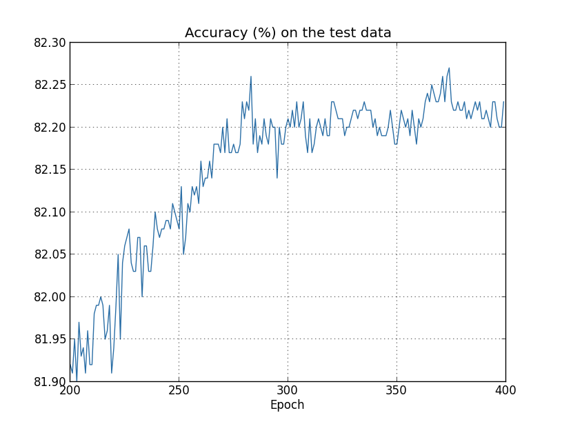

# overfitting过拟合

------
过拟合:表示神经网络模型在训练集上的表现很好，但是泛化能力比较差，在测试集上表现不好

> overfitting的例子:


横坐标为x，纵坐标为y,每个黑点为训练集的训练实例,红色线条是我们训练得出的方程，可以看出
训练的模型能够完美的拟合训练集的实例。而黑色的虚线方程也可以比较好的拟合我们的训练实例。

> 黑色方程好还是红色方程好?

红色线段虽然完美的拟合的训练实例，但是如果在测试集出现一个点，比如(0.4,0.5)，这个点离我们红色的曲线相差很远，而离黑色曲线很近。这个说明了虽然模型在训练集效果很好，但是在测试集表现比较差，泛化能力很差，而相对的黑色曲线的泛化能力就比较强。这就是过拟合(overfitting)


实验, 假设MNIST只用1,000个来训练(依然沿用之前的程序，请参考>[手写识别的demo](https://github.com/mnielsen/neural-networks-and-deep-learning)


``` 
>>> import mnist_loader 
>>> training_data, validation_data, test_data = \
... mnist_loader.load_data_wrapper()
>>> import network2 
>>> net = network2.Network([784, 30, 10], cost=network2.CrossEntropyCost) 
>>> net.large_weight_initializer()
>>> net.SGD(training_data[:1000], 400, 10, 0.5, evaluation_data=test_data,
... monitor_evaluation_accuracy=True, monitor_training_cost=True)
```

> cost随着训练轮数增多逐渐下降


> 准确率的变化情况



可以看出在280次迭代之前,准确率一直在变高，然后在300次迭代后准确率几乎不提高甚至下滑的迹象，这说明出现了overfitting。300次迭代后的学习是没有任何意义的，模型已经记住了我们的学习情况。

> 如何检测overfitting的发生

我们之前把数据集切分为训练集，测试集和验证集。验证集就是用来检测模型overfitting。
一旦在验证集上，准确性不在变化(收敛了),那么我们就停止训练。

> 下次笔记讲介绍几种降低overfitting的方法