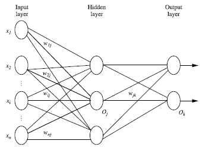

# SoftMax激活函数介绍

-------

SoftMax定义了神经网络新型的输出方法，他不改变神经网络的加权输入(即中间量Z)：$z^L_j = \sum_{k} w^L_{jk} a^{L-1}_k + b^L_j$

回顾下神经网络的输入输出流程
> 神经网络结构

> 神经元输入输出过程

前一层的输出值作为后一层的输入值，经过加权求和并加上偏向得到中间变量Z，然后通过激活函数(非线性转化)得到这个神经元的值

>sigmoid函数公式:

$$a=\sigma(z)=\frac{1}{1+e^{-z}}=\frac{e^z}{1+e^z}$$

>新型激活函数SoftMax公式（向量形式表示的公式）:

$$\begin{eqnarray} 
  a^L_j = \frac{e^{z^L_j}}{\sum_k e^{z^L_k}},
\end{eqnarray}$$

关于激活函数感觉没有什么好介绍的，纯粹的公式

> 需要注意的是:sigmoid一般用于二分类问题，而SoftMax用于多分类问题